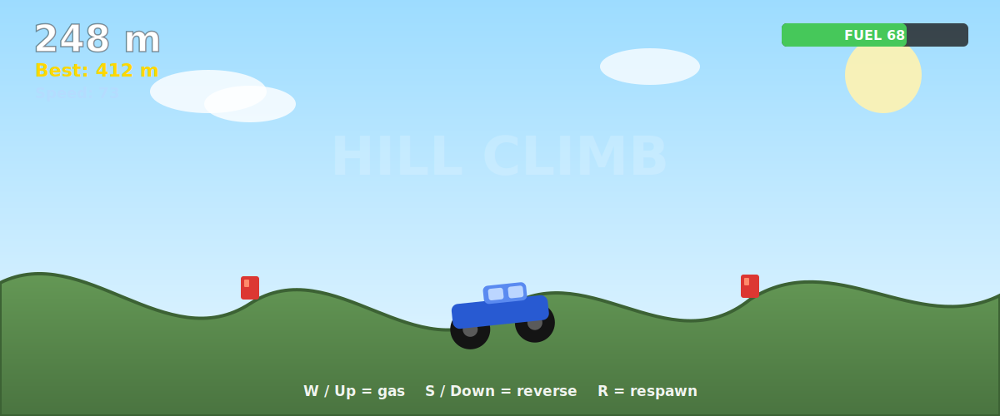

# Hill Climb (3D terrain racer for Roblox)

<p align="center">
  
</p>

<p align="center"><sub><i>Illustrated preview (matches the in-game colors, hills, buggy, and HUD). A real in-engine capture will replace this once the game is published.</i></sub></p>

Drive a buggy as far as you can across endless rolling hills. Grab fuel cans,
don't run dry, and beat your best distance. Built entirely from code, so there
is nothing to model by hand: the road, the car, and the HUD are all generated
at runtime.

```
hill-climb-roblox/
  default.project.json     Rojo mapping (filesystem -> Roblox)
  src/
    shared/Config.lua      All tuning values + the hill shape
    server/Main.server.lua World + car + physics + scoring
    client/HUD.client.lua  Distance / fuel / speed display
    client/Controls.client.lua  R to respawn
```

---

## 1. One time setup (account + Studio)

You said you need this from scratch, so:

1. **Make a Roblox account.** Go to https://www.roblox.com and sign up. A
   throwaway email is fine. Verify the email (needed before you can publish).
2. **Install Roblox Studio.** Go to https://create.roblox.com , click
   **Start Creating**, and it downloads `RobloxStudioInstaller.exe`. Run it and
   log in with the account from step 1.
3. **Open a blank place.** In Studio: **New** -> **Baseplate**. Leave it open.

## 2. Install the tooling (Rojo)

Rojo syncs these files on disk into Studio.

1. Install Rojo (pick one):
   - Easiest: install the **Aftman** toolchain manager, or
   - Download the `rojo.exe` release from https://github.com/rojo-rbx/rojo/releases
     and put it somewhere on your PATH.
   - To check it worked, in a terminal run: `rojo --version`
2. In Roblox Studio install the **Rojo plugin**: top menu **Plugins** ->
   **Manage Plugins** -> search "Rojo" -> Install. (Or get it from the Studio
   plugin marketplace.)

## 3. Sync and test

1. In a terminal, from this folder:
   ```
   cd C:\Users\syed2\hill-climb-roblox
   rojo serve
   ```
   It prints something like `Rojo server listening on port 34872`.
2. Back in Studio, open the **Rojo** plugin panel and click **Connect**. Your
   files now appear in Studio (ServerScriptService, ReplicatedStorage,
   StarterPlayer).
3. Press **Play** (F5). You spawn sitting in the buggy. Drive with **W / S**.
   Fuel cans refill you, **R** respawns you if you flip or get stuck.

No Rojo? See "Manual paste fallback" at the bottom.

## 4. Publish so others can play

1. In Studio: **File** -> **Publish to Roblox** (the first time it is "Publish
   to Roblox As..."). Give it a name like *Hill Climb*, pick a genre, **Create**.
2. Make it public: go to https://create.roblox.com -> **Creations** -> your
   game -> the place -> **...** menu -> **Configure** -> set **Playability** /
   **Active** so the public can join. (New accounts sometimes need email
   verification before a game can go public.)
3. Share the game link. Done.

> Note on "deploy": Roblox has no headless publish from the command line, so the
> publish click in Studio (step 4) is the real deploy. Everything before it is
> automated by the files in this repo.

---

## Tuning (edit `src/shared/Config.lua`, re-sync, re-Play)

| Want | Change |
|------|--------|
| Steeper / gentler hills | the multipliers in `HeightAt` (the `* 16`, `* 8`, `* 3`) |
| More climbing power | raise `WheelSpeed` or `MotorTorque` |
| Easier climbs | lower `Gravity` (e.g. 90) |
| Longer track | raise `RoadLength` |
| More / less fuel pressure | `MaxFuel`, `FuelBurn`, `FuelCanSpacing` |

**Car drives backwards?** Flip `Config.DriveSign` from `-1` to `1`.

## Manual paste fallback (no Rojo)

If you skip Rojo, you can paste the code in by hand:
1. In Studio Explorer, right click **ServerScriptService** -> Insert **Script**,
   paste `src/server/Main.server.lua`. But it `require`s a Config module, so
   also: right click **ReplicatedStorage** -> Insert **Folder** named `Shared`
   -> inside it Insert a **ModuleScript** named `Config`, paste
   `src/shared/Config.lua`.
2. Right click **StarterPlayer** -> **StarterPlayerScripts** -> Insert two
   **LocalScripts**, paste `HUD.client.lua` and `Controls.client.lua`.
3. Press Play.

Rojo is much less error prone, so prefer step 3 above.
